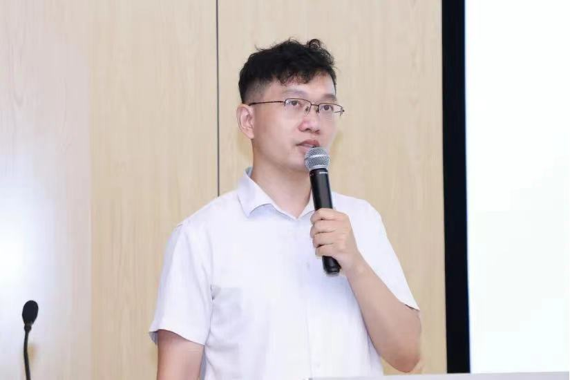

## 朱洪银

* 联系方式： 18810119372 （微信）
* 地址：北京市海淀区上地信息路
* 业务范围：我们专注于为全球各行各业提供卓越的智慧计算、知识图谱解决方案，业务范围涵盖数据中心和边缘计算服务器的销售、一体化设备的提供，以及针对知识图谱和大模型软件的技术支持。致力于为客户提供全方位的服务和保障，以满足不同行业的个性化需求。为各垂直行业构建了知识图谱并提供智能服务，包括智慧文旅、汽车产业、通用人工智能、脑科学等行业。通过我们的高性能数据存储、知识图谱网站、大语言模型、推荐引擎等服务，我们为企业和研究机构提供了强大的支持，提高了用户体验并为他们相关的产品创造了巨大的经济效益。

## 1 科创产业产品案例

* AI边缘计算智能终端

边缘计算智能终端是一款创新的科技产品，集成了对话机器人和绘画机器人系统。这种设备可以实现在本地进行智能分析和决策，为用户提供更加高效和个性化的服务。通过边缘计算技术，这些终端可以在离用户更近的地方处理数据，从而降低延迟并提高用户体验，保护数据隐私。无论是家庭还是企业环境，这款科创产品都能为用户带来便捷和乐趣。

* 垂直行业的知识中台
  
垂直行业结构化、半结构化、非结构化和图数据管理器是一种创新解决方案，旨在简化企业处理和分析大量不同类型数据的任务。它结合了最新的数据管理和分析技术，使企业能够更有效地利用其数据资产，从而提高决策质量、增加收入并降低成本。该系统提供了强大的数据整合、清洗和转换功能，以及高级分析工具，以揭示隐藏的趋势和模式。

* 股票市场金融数据挖掘系统

股票市场金融数据挖掘系统是一款创新的金融科技工具，旨在帮助企业和个人从海量股票市场中提取有价值的信息和洞察。该系统利用先进的数据分析和挖掘技术，对金融市场进行深度研究，为企业提供有关市场趋势、投资策略和风险管理的宝贵建议，从而助力他们在竞争激烈的市场环境中取得成功。

## 2 科创产业最新动态
### 2.1 受邀作报告
* [《干一行AI一行》](https://www.bilibili.com/video/BV1Xzi6YNEdd/?share_source=copy_web&vd_source=067b9b1a035ce6f22c43ce131fd58ee1)--“360短视频挑战赛”入围作品. 2024.12，360公司
* [人工智能应用大讲堂系列活动讲座](https://edu.bsia.org.cn/course/video?id=1866732791934214145)，2024.09. 北京软件和信息服务业协会（免费公开课程）
* [知识增强的高效大模型实践](https://finance.sina.com.cn/jjxw/2024-10-14/doc-incsnqmf1665433.shtml). 2024.09. [智谱AI、气象局](https://www.cma.gov.cn/2011xwzx/2011xqxkj/2011xkjdt/202410/t20241014_6636586.html)
* [智慧算力策略：大模型与知识图谱的协同探索. 2024.07](https://www.bsia.org.cn/site/content/27234.html), [北京化工大学](https://cist.buct.edu.cn/2024/0722/c981a196977/page.htm)
* 大模型时代的知识工程：从产业和技术角度. 2024.03，北京建筑大学
* 智慧计算知识图谱（加长版）. 2023.12.27，浪潮集团精品课程
* [大模型时代的知识工程研究进展. 2023.12.01，兰州财经大学](https://mp.weixin.qq.com/s?__biz=MzUzODA1Nzg1OA==&mid=2247523531&idx=1&sn=5381c5a6df3bb7a5e7873314febef1d9&chksm=fadf5126cda8d8305b812605530ea6aef55e69ca0605ae8db99ccdef2b2fe071f8f0c68def06&scene=27)
* 3D AI大模型与文化遗产智慧系统. 2023.11.01, 中山大学
* 大模型时代的知识图谱研究进展. 2023.09.22，中山大学
* 智慧计算知识图谱. 2023.09，浪潮电子信息产业股份
* [数字人文知识图谱构建. 2022.10.05，中山大学](https://mp.weixin.qq.com/s?__biz=MzIyNTU2MTU2Mg==&mid=2247503871&idx=1&sn=56833448dcb3d92462ed0f212acc986d&chksm=e87f514adf08d85c7d90da4128781f97fd0afabd09105fffb3c1d2afa3d51d59609ec0ce3484&scene=27)
* [知识图谱, 2021.06, 沪东中华造船集团](https://www.cs.tsinghua.edu.cn/info/1031/4597.htm)
* [知识图谱, 2020.09, 酒泉卫星发射中心](https://postdoctor.tsinghua.edu.cn/info/zxjx/2031)

### 2.2 研究提案/指南
* [金融等垂直领域RAG技术]()
* [大模型预训练数据工程技术]()
* [多智能体技术研究]()
* [图基础模型技术研究]()
* [模型压缩技术研究]()
* [多模态大模型技术研究]()
* [大模型推理加速技术研究]()
* [脑结构连接降维与认知评分研究（脑科学）]()
* [图嵌入与检索加速技术研究](2024/doc/embedding.jpg)
* [基于多模态数据的大语言模型和图神经网络融合技术研究](2024/doc/2024-02.pdf)
* [面向人工智能模型的数据治理软硬件协同关键技术研究](2024/doc/2023-08.pdf)
* [数据中心服务器智能化管理系统](2024/doc/2022-12.pdf)

### 2.3 担任以下国际期刊审稿人
* 人工智能领域：《[Expert Systems with Applications](https://www.sciencedirect.com/journal/expert-systems-with-applications)》，《[IEEE Transactions on Neural Networks and Learning Systems](https://ieeexplore.ieee.org/xpl/RecentIssue.jsp?punumber=5962385)》，《[Neurocomputing](https://www.sciencedirect.com/journal/neurocomputing)》等
* Nature旗下：《[Scientific Reports](https://www.nature.com/srep/)》,《[Social Network Analysis and Mining](https://link.springer.com/journal/13278)》,《[International Journal of Data Science and Analytics](https://link.springer.com/journal/41060)》,《[Knowledge and Information Systems](https://link.springer.com/journal/10115)》，《[The Journal of Supercomputing](https://link.springer.com/journal/11227)》，《[Artificial Intelligence Review](https://link.springer.com/journal/10462)》，《[International Journal on Document Analysis and Recognition](https://link.springer.com/journal/10032)》，《[BMC Medical Informatics and Decision Making](https://bmcmedinformdecismak.biomedcentral.com/)》等
* 交叉领域：《[Intelligence-Based Medicine](https://www.sciencedirect.com/journal/intelligence-based-medicine)》，《[Computers, Materials & Continua](https://www.techscience.com/journal/cmc)》,《[PLOS ONE](https://journals.plos.org/plosone/)》
* 担任期刊编委：《Journal of Artificial Intelligence and Robotics》，《Machine Learning in Engineering and Technology》

### 2.3 参加活动
* [极客公园创新大会 2025，2024.12，北京](pic/2024/09.png)
* [资本赋能新智生产力高质量发展（北京大学），2024.11，北京](pic/2024/08.png)
* [第一届风和论坛（智谱AI、气象局），2024.09，北京](pic/2024/07.png)
* [ISC.AI 2024--第12届互联网安全大会，2024.07，北京](pic/2024/06.jpg)
* ["人工智能应用大讲堂"系列活动第三期，算力困局与破局之道，2024.07，北京](https://mp.weixin.qq.com/s/guScjbB9QMGFUkb_ryWUrg)
* [摩根大通（JP Morgan）金融文档大模型研讨会，2024.03.20，北京](pic/2024/02.png)
* [第一届龙蜥操作系统大会 (OpenAnolis Conference 2023)，2023.12.17，北京](pic/2023/13.jpeg)
* [AICC 2023 人工智能计算大会，2023.11.29，北京](pic/2023/12.jpg)
* [存储服务器和GPU显卡库存，2023.10.31，北京](pic/2023/11.jpg)
* [Amazon亚马逊生成式AI构建活动，2023.10.24，北京](pic/2023/10.png)
* [中国企业家俱乐部，2023.9.27，北京](pic/2023/04.jpg)
* [大模型重塑金融科技--新一代软件工程与场景落地研讨会，2023.9.22，北京](pic/2023/03.jpg)
* [以边缘～致多元，2023.9.22，北京](pic/2023/01.jpg)
* [第十七届全国知识图谱与语义计算大会，2023.08.24，沈阳](pic/2023/02.jpg)
  
## 友情链接
1. [学术名片](https://liftkkkk.github.io/)
