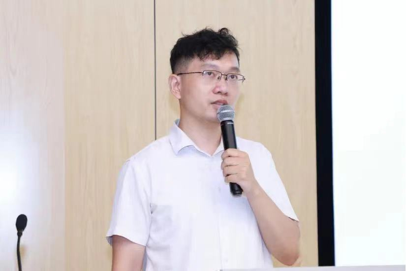

  

<h1 align="center">朱洪银</h1>

  🚀 AI研究者｜🧠 本体大模型（LOM）｜🏢 企业智能决策

  知识图谱 · 大模型 · 多智能体 · 决策智能

---

## 🧭 关于我

- 🏢 AI Lab负责人 / 算法专家（用友网络、360、浪潮、彩讯）
- 🧠 语言与知识计算专委会委员
- 📄 发表20+篇 SCI/EI论文 ｜ 授权20+项发明专利  
- 📚 出版专著：《高频算法设计》
- 🎤 多所高校 & 产业大会特邀报告人  

> 长期专注于 **大模型 × 知识图谱 × 企业决策智能**，致力于推动 AI 从“内容生成”走向“理解与决策”。

---

## 🔥 研究方向与愿景

### 🧠 本体大模型（Large Ontology Model, LOM）

> 面向企业复杂系统的新一代 AI 架构范式

融合以下核心能力：

- 🗣️ 大语言模型（LLM）：语义理解与生成  
- 🕸️ 知识图谱（KG）：结构化认知与约束  
- 📊 表格智能（Tabular Intelligence）：业务决策数据  
- 🤖 多智能体（Multi-Agent）：任务执行与协同  

👉 **目标：构建具备“理解-推理-决策”能力的企业级AI系统**

---

## 🧪 代表报告

- 🎤 智能体时代如何避免被大模型反噬（中山大学，2025）
- 🎤 知识增强的大模型实践（智谱AI × 气象局）
- 🎤 大模型时代的知识工程（多所高校）
- 🎤 3D AI + 数字人文（中山大学）

👉 更多内容持续更新中...

---

## 🧩 代表项目

### 🏢 企业知识智能中台
- 多源数据统一建模（结构化 / 文档 / 图）
- RAG + 知识增强大模型
- 支撑企业级智能决策系统

---

### 🤖 本体驱动智能体（Ontology-Driven Agent）
- 基于本体建模的智能体框架  
- 支持复杂业务逻辑推理  
- 企业自动化决策核心引擎  

---

### ⚡ AI 边缘计算智能终端
- 本地部署大模型与多模态能力  
- 低延迟 + 数据隐私保护  
- 面向企业与家庭的智能终端设备  

---

## 📚 研究课题

- RAG（检索增强生成）
- 知识增强大模型
- 多智能体系统（Multi-Agent）
- 图基础模型（Graph Foundation Model）
- 大模型推理加速
- 多模态大模型
- 数据治理与数据中心AI

---

## 🏆 学术服务

**期刊审稿人：**

- IEEE TNNLS  
- Information Fusion  
- Neurocomputing  
- Expert Systems with Applications  

**编委：**

- Journal of Artificial Intelligence and Robotics  
- Machine Learning in Engineering and Technology  

---

## 🌐 学术与产业活动

- CIPS-SMP 全国社会媒体处理大会  
- ISC.AI 互联网安全大会  
- OpenAnolis 操作系统大会  
- AICC 人工智能计算大会  

---

## 💡 技术理念

> **AI = 数据 × 知识 × 模型 × 系统**

- 大模型不是终点，而是入口  
- 知识图谱是AI的“长期记忆”  
- 智能体是AI的“执行系统”  
- 企业AI的核心在于：**决策能力**

---

## 📫 联系方式

- 📱 微信：18810119372  
- 📍 北京市海淀区  
- 🌐 学术主页：https://liftkkkk.github.io/

---

  ⭐ 如果你对企业AI / 本体大模型 / 智能体方向感兴趣，欢迎交流合作！

